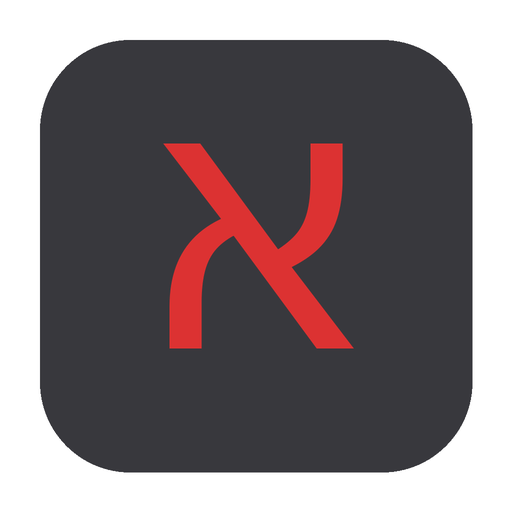

<div align="center">
  

  # keyboard

  [](LICENSE)
  [](https://v2.tauri.app)
  [](https://react.dev)
  []()

  **Always-on-top virtual keyboard overlay that types into any app — like macOS Accessibility Keyboard, but prettier**

  [Features](#-features) · [Quick Start](#-quick-start) · [Architecture](#-architecture) · [Contributing](#-contributing)

</div>

---

## 🎯 What is this?

A floating keyboard overlay that sits on top of all your windows. Click a key on the overlay — it types into whatever app has focus. Type on your physical keyboard — the overlay lights up in real time.

Currently ships with a **Hebrew layout** (English + Hebrew dual labels). More keyboard layouts and visual designs are planned.

## ✨ Features

- **🖱️ Click-to-type** — click any key on the overlay to inject keystrokes into the focused app via macOS CGEvent API
- **⌨️ Live key animation** — physical keyboard presses highlight corresponding keys in real time via CGEventTap
- **🪟 Non-activating overlay** — uses NSPanel so clicking the keyboard never steals focus from your target app
- **🔤 Layout detection** — automatically detects active input source (Hebrew/English) and emphasizes the corresponding labels
- **📌 Always on top** — floats above all windows, draggable with screen-edge snapping
- **🔀 Sticky modifiers** — single-click a modifier to apply it to the next keypress; double-click to lock it
- **📏 Resizable** — drag the corner handle to scale the keyboard up or down (0.5x–1.5x)
- **🫧 Collapsible** — collapse to a tiny draggable pill icon, click to expand back
- **🍎 Menu bar control** — tray icon with Show/Hide and Quit (no dock icon clutter)

## 🚀 Quick Start

### Prerequisites

- **macOS** (arm64) — the native keyboard APIs are macOS-specific
- **Node.js** 18+
- **Rust** toolchain (`rustup` with stable)
- **Tauri CLI** — installed via npm

### Build & Run

```bash
# Clone the repo
git clone https://github.com/erimeilis/keyboard.git
cd keyboard

# Install dependencies
npm install

# Development mode (hot reload)
npm run tauri:dev

# Production build
npm run tauri:build
```

The built `.app` and `.dmg` appear in `build/`.

### ⚠️ Accessibility Permission

On first launch, macOS will prompt for **Accessibility** permission. You must grant it in:

**System Settings → Privacy & Security → Accessibility → Hebrew Keyboard → ON**

> After each rebuild, the code signature changes. You'll need to toggle the permission **OFF then ON** and relaunch the app for it to take effect.

## 🏗️ Architecture

```
keyboard/
├── src/                          # React frontend
│   ├── App.tsx                   # Window controls, drag, collapse, scale
│   ├── components/
│   │   ├── Keyboard.tsx          # Keyboard layout, key click → simulate_key
│   │   ├── Key.tsx               # Individual key component (4 variants)
│   │   └── Keyboard.css          # Key themes (black/gray/red), press states
│   ├── hooks/
│   │   └── useKeyboardLayout.ts  # Polls active input source (Hebrew/English)
│   └── utils/
│       └── keyMapping.ts         # Maps backend key codes → component IDs
├── src-tauri/                    # Rust backend
│   └── src/
│       ├── lib.rs                # App setup, NSPanel, tray icon, accessibility check
│       ├── keyboard_listener.rs  # CGEventTap FFI — listens to physical keyboard
│       ├── key_simulator.rs      # CGEvent — injects keystrokes into focused app
│       ├── layout_detector_macos.rs  # TIS API — detects active keyboard layout
│       └── simulate_flag.rs      # AtomicBool to prevent feedback loops
├── scripts/
│   └── copy-build.js             # Copies build artifacts to build/
└── build/                        # Production .app and .dmg (gitignored)
```

### How It Works

```
Physical keyboard → CGEventTap (listener) → Tauri event → React state → key highlights
Overlay click → React → Tauri command → CGEvent (simulator) → target app receives keystroke
```

| Component | Technology | Purpose |
|-----------|-----------|---------|
| Keyboard listener | Raw CGEventTap FFI | Captures physical key events without stealing focus |
| Key simulator | `core-graphics` CGEvent | Injects keystrokes via `post_to_pid` to the focused app |
| Layout detection | Carbon TIS API | Reads `TISCopyCurrentKeyboardInputSource` for Hebrew/English |
| Window management | `tauri-nspanel` | NSPanel with NonactivatingPanel style mask |
| Frontend | React 19 + TypeScript | Keyboard rendering, state management, window controls |

### Key Design Decisions

- **Raw CGEventTap FFI** instead of the `rdev` crate — `rdev` silently fails on macOS Tahoe when Input Monitoring is separated from Accessibility
- **NSPanel with Accessory activation policy** — prevents the overlay from appearing in the dock or stealing focus, while staying above all windows
- **`post_to_pid`** instead of `post(Session)` — ensures keystrokes go to the correct app even when the overlay is clicked
- **Event marker (`0x4B424F56`)** on simulated events — so the listener can filter out its own injected keystrokes and avoid feedback loops

## 🛠️ Development

```bash
# Run tests
npm test

# Type check
npx tsc --noEmit

# Dev mode with hot reload
npm run tauri:dev
```

### Project Scripts

| Script | Description |
|--------|-------------|
| `npm run tauri:dev` | Start development with hot reload |
| `npm run tauri:build` | Production build → `build/` directory |
| `npm test` | Run Vitest test suite |
| `npm run dev` | Vite dev server only (no Tauri) |

## 🗺️ Roadmap

- [ ] Additional keyboard layouts (Arabic, Chinese, Japanese, etc.)
- [ ] Custom keyboard visual themes/skins
- [ ] Windows and Linux support
- [ ] Layout editor for custom key mappings

## 🤝 Contributing

Contributions are welcome! Whether it's a new keyboard layout, a visual theme, or a bug fix.

1. Fork the repository
2. Create a feature branch (`git checkout -b feature/my-layout`)
3. Make your changes and test them
4. Submit a pull request

## 📄 License

[MIT](LICENSE) — use it however you like.
